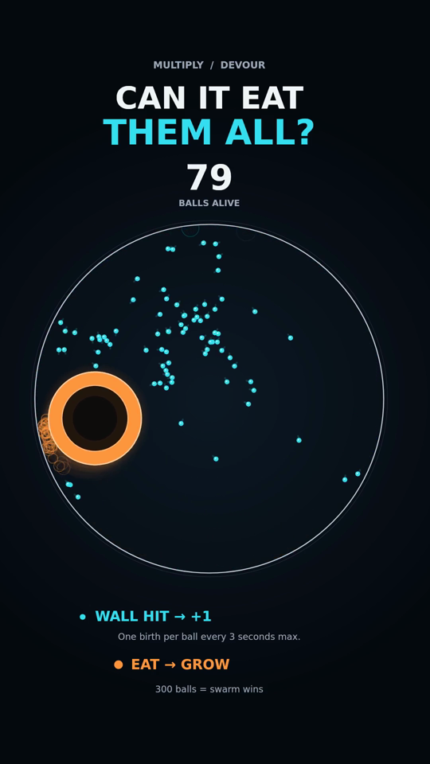

# Can It Eat Them All?

**The balls multiply. The eater grows. Who wins?**

An original, interactive 2D simulation made with JavaScript and Canvas. Cyan balls reproduce at the arena wall while an orange eater chases and consumes them. Each reproduction or capture contributes to the sound.



## Watch or play

- **Watch the finished Short:** [Pilot 01 — MP4](media/can-it-eat-them-all-pilot-01.mp4).
- **Play offline:** download this repository, extract it, and open `index.html` in your browser. Click **Play** to enable sound.
- **Publish a live version:** follow [the GitHub guide](docs/GITHUB_SETUP.md). The site needs no build step or backend.

The browser player is a single standalone HTML file. It works without internet access, external scripts, account creation, or API keys.

## The rules

1. The arena starts with **24 balls**.
2. When a ball hits the wall, it creates one new ball if its **3-second reproduction cooldown** has expired. Newborn balls start with a full cooldown. Initial balls start with different cooldown offsets.
3. The eater steers toward the nearest ball at a constant speed with a fixed turning limit.
4. Every capture increases the eater's area.
5. The eater wins when no balls remain. The swarm wins if the population reaches **300**.

The rules stay the same throughout the run. Balls pass through one another, and reproduction creates new particles. This is a toy simulation with invented rules, rather than a model of real black holes or biological populations. The pursuit behavior is a simple algorithm, with no machine learning.

## Controls

| Control | Action |
| --- | --- |
| Play / Pause | Start or pause playback |
| Restart | Replay the same experiment |
| Timeline | Jump to a different point in the run |
| Synchronized sound | Mute or unmute |
| Volume | Adjust audio volume |
| Full screen | Expand the canvas, where supported |
| Space | Play or pause when a control does not have keyboard focus |
| R | Restart |
| M | Mute or unmute |

Playback pauses when the browser tab is hidden.

## Project layout

| Path | Purpose |
| --- | --- |
| `index.html` | Ready-to-play English browser version; also the GitHub Pages entry point |
| `src/simulation.js` | Seeded randomness, motion, reproduction, pursuit, captures, and ending |
| `src/renderer.js` | Vertical composition, text, trails, and visual effects |
| `src/audio.js` | Event-driven notes and sound-rate limits |
| `src/player.js` | Browser playback, seeking, audio controls, and keyboard shortcuts |
| `web/template.html` | Editable English interface and styles |
| `scripts/build-html.py` | Bundles the sources into the standalone player |
| `scripts/render-video.cjs` | Renders frames to a silent MP4 and records audio events |
| `scripts/make-audio.py` | Synthesizes sound and produces the final MP4 |
| `media/` | Approved English video |
| `assets/` | README preview image |
| `docs/` | Publishing copy, GitHub instructions, and run data |
| `output/` | Generated export files; created when rendering and excluded from Git |

## Run the browser version

Open `index.html` directly. Node.js, Python, and FFmpeg are **not required** to play it.

If your browser opens an HTML download as text, use **Open with** and choose a web browser. If you are viewing the source on GitHub, use the GitHub Pages site or download the file to run it.

## Edit the project

Edit the files in `src/` and `web/`, then rebuild the standalone player from the repository root:

```sh
python scripts/build-html.py
```

On systems where Python is named `python3`, use that command instead. Rebuilding requires only Python's standard library.

Do not edit the generated `index.html` as your primary source: rebuilding replaces it. Commit the rebuilt `index.html` along with your source changes so the live site uses the new version.

## Export a new MP4

Optional export requirements:

- Node.js with npm.
- Python with NumPy.
- FFmpeg installed and available on your system PATH.

Install the project dependencies from the repository root:

```sh
npm install
python -m pip install -r requirements.txt
```

Render the simulation, then synthesize and attach its audio:

```sh
node scripts/render-video.cjs
python scripts/make-audio.py
```

The finished file is `output/can-it-eat-them-all-pilot-01.mp4`. The output folder also contains the silent video, WAV audio, event notes, and run report. `npm run export` runs both steps when `python` is available under that name.

If FFmpeg is not found, install it and reopen your terminal. If NumPy is missing, install it with the same Python interpreter used to run `make-audio.py`.

The renderer uses DejaVu Sans as an Arial alias when the standard Linux font files are available. Otherwise it uses the system font fallback, so text appearance can differ across machines. The supplied MP4 is the approved reference export.

## Experiment with the rules

Default parameters live in the `Simulation` constructor in `src/simulation.js`.

| Parameter | Default | Effect |
| --- | --- | --- |
| `seed` | 14 | Initial placement, velocities, cooldown offsets, and offspring directions |
| `initial` | 24 | Initial ball count |
| `arena` | 365 | Arena radius in internal units |
| `particleSpeed` | 205 | Ball speed in units per second |
| `hunterSpeed` | 295 | Eater speed in units per second |
| `cooldown` | 3 | Minimum seconds between reproductions for one ball |
| `growth` | 22 | Increase in squared eater radius per capture |
| `hunterRadius` | 29 | Initial eater radius |
| `turn` | 2.4 | Maximum steering rate in radians per second |
| `limit` | 300 | Population needed for a swarm victory |

The eater's radius is `sqrt(hunterRadius² + eaten × growth)`. Simulation updates use a fixed 1/120-second timestep; video output is 60 fps.

If you change the rules, update their on-screen descriptions in `src/renderer.js` and `web/template.html` too. The pilot's player duration is set to 48.15 seconds in `src/player.js`, with matching timeline values in the template. Update those values if an experiment changes the runtime. The video renderer determines its runtime automatically and stops with an error if the experiment has no ending within 120 simulated seconds.

## Sound design

All sounds are synthesized from original event-driven tone sequences. There are no sampled recordings or third-party songs. Rapid events are rate-limited to keep dense sections intelligible. The exported audio includes light harmonics and a short stereo echo; the browser uses a lighter oscillator mix driven by the same events.

## Pilot results

<details>
<summary>Show the outcome and verification details (spoilers)</summary>

- First reproduction: approximately **0.367 seconds**.
- First capture: approximately **0.392 seconds**.
- Peak population: **149**.
- New balls: **583**.
- Total balls consumed: **607**, including the 24 initial balls.
- Natural ending: approximately **45.542 seconds**.
- Finished video: **48.15 seconds**, including the result screen.
- Video: **1080 × 1920**, **60 fps**, H.264, with 48 kHz stereo AAC audio.

This run was selected after comparing parameter combinations. It does not estimate the probability of either side winning across random runs. Restarting repeats the fixed seed and result.

Population accounting, arena containment, finite coordinates, deterministic replay, and natural termination were checked. The standalone player was exercised in a Canvas/DOM test harness for drawing, advancement, seeking, and restarting. Real-browser playback was not verified in the build environment. Exported video frames and stream metadata were checked.

Detailed run data is in [docs/run-report.json](docs/run-report.json).

</details>
